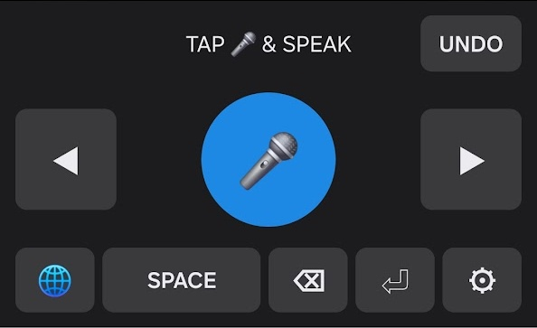

# koetype — 声で打つ Android キーボード

**日本語** | [English](README.en.md)

音声入力特化のカスタム Android IME。マイクボタンを押して話し、停止すると
音声バッファを STT（音声認識）API に送り、結果のテキストを現在の入力欄に挿入する。
Typeless 系の「バッファ方式」ボイスキーボードの自作実装。

```
[マイクをタップ] → 録音中（もう一度タップで停止）
      → m4a バッファを STT API へ送信 → 転写テキストを入力欄に commitText
```



- どのアプリでも使える（システムキーボードとして動作）
- 多言語対応（Whisper 系モデルの言語ヒントを設定可能）
- 挿入位置の調整と取り消し: ◀▶ カーソルキー（長押しリピート）と、
  直前の転写だけを安全に取り消す **UNDO** キー
- UI 表記は意図的に**中学英語のみ**（TAP 🎤 & SPEAK / UNDO / SPACE …）。
  端末の言語設定によらず全員が同じ表記を見る。理由と全文字列の対訳は
  [docs/LOCALIZATION.md](docs/LOCALIZATION.md)（DD-014）
- STT はプロバイダ抽象化層（`SttEngine`）— 現在は OpenAI transcription API 実装

## 思想 — 鍵も端末も音声もあなたのもの

- **BYOK（Bring Your Own Key）**: API キーは利用者が自分で取得し、自分の端末に
  入力する。アプリには同梱しない。作者のサーバーも存在しない。利用料金は
  OpenAI からあなたに直接請求される — コストの把握も、上限の設定も、キーの失効も、
  全部あなたの手の中にある。中間に誰もいないから、不透明なマージンもクォータもない。
- **音声の経路**: 録音はマイクボタンを押した間だけ。音声はあなた自身のキーで
  OpenAI へ**直接**送信され、転写後に端末から削除される。作者を含む第三者は
  経由しない。あなたの声の行き先を決めるのは、あなたのプロバイダ選択だけ。
- **「API キーの取得」というハードルはわざと残している**。キーとは何かを理解し、
  取得・課金管理・失効まで自分でできる人が対象（理由は
  [docs/DESIGN-DECISIONS.md](docs/DESIGN-DECISIONS.md) の DD-010）。
- **自分のカスタムアプリが数分で組める時代に、主権を手放す理由がない**。
  今どきの AI に手伝わせれば、このベースをフォークして自分専用の音声入力に
  書き換えるのは数分の仕事だ。便利さと引き換えにデータと鍵を誰かに預ける必然は、
  もうない。データも主権も自分で握っておけ — koetype はそのための、動くベースである。
- **IME は構造上、すべての入力を読める位置にいる**。これがどういうことかと言うと、
  あなたの行動（キー入力）をすべて盗むことも出来るということだ。ただの Android
  アプリではない — この認識を持つことが大事。だからこそ、ソースを読めて
  自分でビルドできることが、キーボードアプリの唯一まともな信頼根拠だと考えている。
  **盲目的に信じるな。読め。そして自分で書き直せ**（AI が最大限サポートして
  くれるのだから）: [THREAT-MODEL.md](THREAT-MODEL.md) — 書き直すための
  差し替え境界も、そこに示してある。

## スナップショット公開について

これは、作者が実務で日常利用しているアプリと**同じコードベース**の
スナップショットです。開発は非公開の原本リポジトリで継続しており、その全てが
ここに同期されるとは限りません。ですから issue / PR への反応は薄いかもしれません
（正直に書いておきます）。逆に、**自分の制御できる範囲で便利な音声入力を
拡張するベースとして使ってほしい** — そのための公開です。

## プライバシー

- 通常のキー入力の内容を収集・送信することはない。
- 送信されるのは、マイクをタップして録音した音声だけ。それも利用者自身が
  設定した API キーで OpenAI へ直接送られる。
- 広告・解析 SDK・テレメトリはゼロ。

## 使ってみる

**→ [docs/GETTING-STARTED.md](docs/GETTING-STARTED.md)** を読めば、何をすれば
よいか分かる。ビルド → インストール → IME 有効化 → API キー設定 → 自分の鍵での
release 署名まで、一通りの流れをすべて経験できるはずだ。

**Android アプリの開発をしたことがなくても大丈夫。分からなければ、手順書ごと
AI に読ませればいい**（そのまま実行手順として通じるように書いてある）。
あなたにできない理由はない。作者の解説が言葉足らずだったら issue にあげてくれ。

```bash
git clone https://github.com/sakai-sktech/koetype.git
cd koetype && ./gradlew assembleDebug
adb install app/build/outputs/apk/debug/app-debug.apk
```

API キー入力欄は Android 標準の Autofill に対応している。Bitwarden / 1Password /
Google パスワードマネージャ / KeePassDX 等に保存したキーを、メール・チャット・
クリップボードを経由せずに入力できる。これはキー管理の責任をアプリ側へ移す
ものではなく、**利用者自身の安全な管理方法を妨げないため**のもの（DD-012）。

## ドキュメント

| 文書 | 内容 |
|---|---|
| [THREAT-MODEL.md](THREAT-MODEL.md) | 何から守り、何は守らないか（設計上のスコープ宣言） |
| [docs/KEY-STORAGE-SECURITY.md](docs/KEY-STORAGE-SECURITY.md) | API キーが端末のどこに・どう保存され、何から守られるか（iOS 移植者向けの「問いの立て方」も収録） |
| [docs/SIGNING.md](docs/SIGNING.md) | Android の署名は何を証明するのか — なぜ「オレオレ署名」が正規設計なのか（図解つき） |
| [docs/DESIGN-DECISIONS.md](docs/DESIGN-DECISIONS.md) | 設計判断ログ DD-001〜013 — なぜこう作ったかは全部ここにある |
| [docs/PRODUCTIZATION.md](docs/PRODUCTIZATION.md) | フォークしてサービス事業化を考える人向けのハードル整理 |
| [docs/GETTING-STARTED.md](docs/GETTING-STARTED.md) | セットアップの全手順 |
| docs/2026-07-08 / 07-09 / 07-21 の各記録 | 実装・検証の実録（エミュレータの罠カタログ、実機クラッシュの診断記録、キー追加の設計記録） |

## 構成

```
app/src/main/java/dev/sakai/koetype/
  ime/        InputMethodService とキーボード UI
  audio/      録音（MediaRecorder → m4a バッファ）
  stt/        SttEngine 抽象化 + OpenAI 実装
  settings/   設定画面・権限フロー
```

フェーズ2 構想 — このベースの伸びしろ:

- **AI 推敲の層を追加する**: 転写後に LLM を一段挟む。フィラー除去・整文から、
  特定ドメイン用の正確な言葉にしたテキスト化まで
- **ストリーミング化**: バッファ方式からリアルタイム文字起こしへ近づける
- **ローカル STT**: いずれスマホ単体でこの精度の文字起こしは出来るようになる。
  そのときは `SttEngine` の下に whisper.cpp 等を差すだけでいい
- **UI ローカライズ**: 現状は中学英語のみ（DD-014）。母語表示が欲しくなったら
  `values-<lang>/strings.xml` を足すだけ。全文字列の台帳は
  [docs/LOCALIZATION.md](docs/LOCALIZATION.md) に整備済み
- こうした方向へ、**使う人が自分専用のツールとしてカスタマイズしていってほしい**。
  そのための差し替え境界が `SttEngine` である

## License

[MIT](LICENSE)
