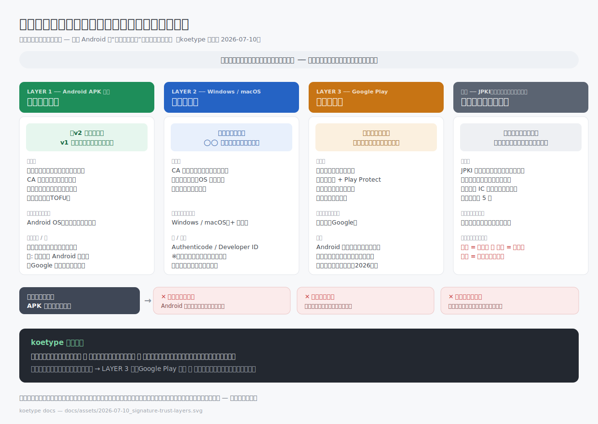

# Android アプリ開発における署名 — その署名は何を証明するのか

この文書は、koetype を自分でビルドして署名する人（GETTING-STARTED §6）と、
「署名」という言葉に漠然とした不安や誤解を持ったままアプリを配る人のための解説。
出発点は、開発中に実際に出た素朴な疑問である:

> **「署名が必要なら、マイナンバーカードの署名用の鍵でやれば一番強力で確実なんじゃないの？」**

答えは「噛み合わない」なのだが、**なぜ噛み合わないかを開いていくと、
コード署名の信頼モデル全体が見通せる**。それを 1 枚にまとめたのが次の図で、
本文はその解説である。

## 中心の問い

**その署名は、何を証明するためのものか。**

「電子署名」はひとつの技術に見えて、目的の異なる複数のレイヤーに分かれている。
目的が違えば「正しい鍵」の基準も、検証する主体も違う。冒頭の疑問が生まれるのは、
レイヤーの違う署名を同じものさしで比べてしまうからだ。

## LAYER 1 — Android APK 署名: 連続性の証明

Android の APK 署名が証明するのは **「v2 の配布者は v1 の配布者と同一である」**、
それだけである。

- **自己署名（いわゆる"オレオレ署名"）が正規の設計。** Google 製アプリも含め、
  すべての Android アプリが自己署名の鍵で署名されている。
- **OS は証明書チェーン（CA）を検証しない。** 証明書に書かれた名前が実在の
  誰かであるかは、仕組みの上で最初から問うていない。
- 信頼の起点は**初回インストール時のユーザーの判断**（TOFU: Trust On First Use）。
  以後、OS は「更新版が同じ鍵で署名されているか」だけを検証し、
  別の鍵で署名された更新の上書きを拒否する。

これが防ぐのは「第三者による偽アップデート」。一度入れたアプリが、
いつの間にか別人の作った悪意ある版にすり替わることを、鍵の同一性で塞いでいる。

だから Android では「立派な機関に発行された鍵」は存在せず、
**鍵の価値は発行元ではなく連続性にある**。同じ鍵で署名し続けられることがすべてで、
鍵を失くすと同じアプリとして更新を配れなくなる（GETTING-STARTED §6 で
「鍵ファイルは自分のバックアップ体制に含めること」と書いた理由がこれ）。

## LAYER 2 — Windows / macOS: 身元の証明

「公的に発行された鍵で署名する」という直感が正解になるのは、こちらの世界。

Windows の Authenticode や macOS の Developer ID は、**CA（認証局）や
プラットフォーム事業者が開発者の身元を審査した証明書**でコード署名し、
OS が証明書チェーンを検証する。証明するのは「このソフトは ◯◯ が作ったものである」
という**身元**であり、未署名や未知の発行元には OS が警告を出す。

つまり冒頭の疑問は、Windows/macOS の署名モデルを Android に当てはめた
ものだったことになる。直感自体が間違っていたのではなく、**OS が違えば
署名の目的が違う**のである。

## LAYER 3 — Google Play: 流通の担保

では Android で「身元」は誰が保証するのか。Android はそれを証明書ではなく
**ストアに置いた**。

Google Play は開発者登録時の本人確認・アプリ審査・Play Protect によって
「この開発者はストアが確認済みである」を担保する。信頼が宿るのは
開発者の証明書ではなくストアという流通機構の側で、だからストアを経由しない
配布（サイドロード）には OS が段階的な警告を出す。

なおこの層は現在進行形で動いている: Google はサイドロードに対しても
開発者検証を拡大する方針を段階的に進めており（2026 年時点）、
「ストア外配布なら身元確認と無縁」という前提は今後変わり得る。

## 番外 — JPKI（マイナンバーカード）: 意思表示・否認防止

マイナンバーカードの署名用電子証明書（JPKI）が証明するのは
**「この申請・文書は本人の意思によるものである」**。e-Tax や行政への電子申請で、
書面の実印＋印鑑証明に相当する役割を担う。氏名・住所・生年月日を内包し、
秘密鍵は IC チップから取り出せず、検証するのは行政の検証基盤と許可を受けた事業者である。

これで APK に署名したらどうなるか。答えは三重に噛み合わない:

| | 何が起きるか |
|---|---|
| **検証者がいない** | Android は証明書チェーンを見ない（LAYER 1）。JPKI 証明書で署名しても、その「公的さ」を検証する主体がインストールの経路上に存在しない |
| **制度の用途外** | 署名用証明書は電子申請のためのもので、コード署名はポリシー外の利用になる |
| **個人情報の配布** | 証明書は APK に同梱されて配布される。氏名・住所・生年月日を全利用者に渡すことになる |

最強の鍵に見えたものは、レイヤーが違う場所では**強力どころか検証すらされない**。
署名の強さは鍵の権威ではなく、「その署名を検証する仕組みが受け手側にあるか」で決まる。

## koetype にとってこれが何を意味するか

koetype はストア配布もバイナリ配布もしない。**自分でビルドして自分の鍵で署名する**のが正規の導入経路である（GETTING-STARTED）。上の地図に置くと:

- **連続性（LAYER 1）はあなたの鍵が保証する。**
  `keytool` で作った自己署名鍵は「オレオレ」だが、それは Android の正規設計そのものであり、手抜きではない。
  あなたの端末上の koetype が、あなたのビルドからしか更新されないことを保証する。
  逆に言うと、そのオレオレ鍵を紛失した途端、同じアプリとして更新できなくなることを頭に入れておくこと。
- **身元（LAYER 2 相当）はソースコードとあなた自身が担う。**
  誰が作ったかをCAに聞く代わりに、何をするコードかを自分で読んで確かめられる
  （[THREAT-MODEL.md](../THREAT-MODEL.md) — IME というカテゴリでは、これが唯一まともな信頼根拠だと考えている）。ビルドしたのはあなたなので、身元の問いは自分自身で閉じる。
- **流通（LAYER 3）は使っていない。**
  ストアの担保がない代わりに、ストアを信頼する必要もない。フォークして誰かに配る段になったら、
  この層（Play 登録＝本人確認・審査・継続的な要件追従）が初めて仕事になる
  （その全体像は [PRODUCTIZATION.md](PRODUCTIZATION.md) と DD-013）。

## 関連文書

- [GETTING-STARTED.md](GETTING-STARTED.md) §6 — 自分の鍵を作って release 署名する実手順
- [THREAT-MODEL.md](../THREAT-MODEL.md) — 何から守り、何は守らないか
- [KEY-STORAGE-SECURITY.md](KEY-STORAGE-SECURITY.md) — API キー保存の防御層（署名とは別レイヤーの話）
- `docs/DESIGN-DECISIONS.md` — DD-013（Play 非登録でも SDK 追随は続ける）
